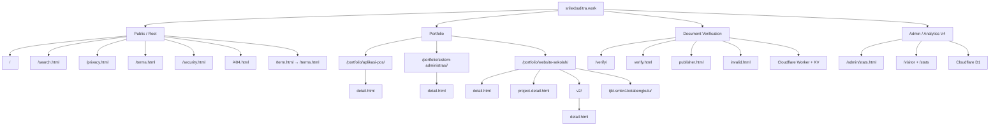

# Visual Sitemap — Website V11.7

> Status: **Current development — Analytics V4**  
> Tujuan: dokumentasi arsitektur halaman tanpa mengubah visual/layout website produksi.

## Prinsip

Visual Sitemap ini merupakan dokumentasi repository. File ini **tidak mengganti `sitemap.xml`** dan tidak menambahkan elemen baru ke halaman produksi. Tampilan website V11.7 tetap dipertahankan.

## Struktur

## Kelompok halaman

**Public / Root** mencakup beranda, pencarian, Privacy, Terms, Security, 404, serta `term.html` sebagai halaman legacy yang mengarah ke `terms.html`.

**Portfolio** berisi demo Aplikasi POS, Sistem Administrasi, Website Sekolah, versi V2, project detail, dan TJKT SMKN 1 Kota Bengkulu. Halaman 404 pada subfolder tetap dipertahankan sebagai fallback.

**Document Verification** mencakup halaman masuk verifikasi, pemeriksaan Document ID/QR, Publisher, invalid state, serta backend Cloudflare Worker + KV.

**Admin / Analytics V4** mencakup dashboard `admin/stats.html`, endpoint analytics `/visitor` dan `/stats`, serta penyimpanan Cloudflare D1.

## Visual

File diagram pendamping:

`visual-sitemap-v11.7.svg`

Palet visual mengikuti website saat ini:
- Background: `#020f1c`
- Panel: `#06243a`
- Gold: `#ffb51b`
- Cyan: `#22c5ee`
- Green: `#00d86a`
- Text: `#f7fbff`

## Versioning

- **V11.6** — baseline stabil/historical audit.
- **V11.7** — current development, dimulai dengan Analytics V4 dan dokumentasi Visual Sitemap.
