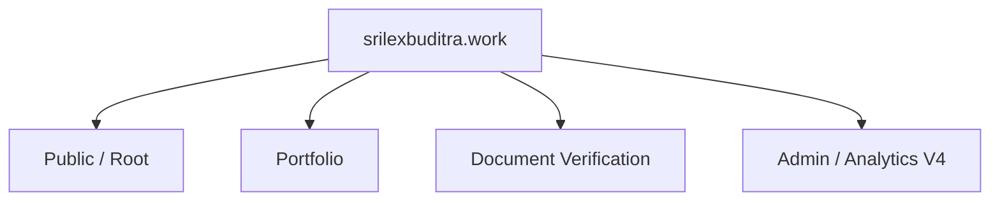

# Visual Sitemap

> **Website:** Srilex Buditra  
> **Domain:** `srilexbuditra.work`  
> **Current Development:** V11.7 — Analytics V4  
> **Stable Baseline:** V11.6  
> **Last Update:** 4 September 2026

Visual Sitemap mendokumentasikan arsitektur website tanpa mengubah tampilan halaman utama.

## Visual

`docs/visual-sitemap.svg`

Visual Sitemap menggunakan **logo yang sama dengan halaman utama**, yaitu:

`images/logo.avif`

Karena SVG berada di folder `docs/`, referensi logo di dalam SVG adalah:

`../images/logo.avif`

## Responsive Layout

Visual Sitemap memiliki tiga layout:

- **Desktop** — empat kolom: Public, Portfolio, Verification, Analytics V4.
- **Laptop / tablet** — dua kolom × dua baris.
- **Mobile / HP** — satu kolom vertikal agar teks dan URL tetap mudah dibaca.

Breakpoint SVG:

- Mobile: `≤ 640px`
- Tablet / laptop: `641px – 1100px`
- Desktop: `> 1100px`

SVG menyesuaikan `viewBox` ketika ukuran layar atau orientasi perangkat berubah.

## Struktur Utama



## Penempatan Repository

```text
/
├── VISUAL-SITEMAP.md
├── images/
│   └── logo.avif
└── docs/
    └── visual-sitemap.svg
```

Nama file sengaja tidak menggunakan nomor versi agar path tetap stabil. Nomor versi tetap ditampilkan di dalam diagram dan dokumentasi.

---

**Srilex Buditra — Full Stack Developer**  
**Current Development:** V11.7 — Analytics V4
