# Visual Sitemap

> **Website:** Srilex Buditra  
> **Domain:** `srilexbuditra.work`  
> **Current Development:** V11.7 — Analytics V4  
> **Stable Baseline:** V11.6  
> **Last Update:** 4 September 2026

Visual Sitemap adalah dokumentasi visual arsitektur `srilexbuditra.work`. File ini membantu melihat hubungan antara halaman publik, portfolio, sistem verifikasi dokumen, dan Analytics V4 tanpa mengubah tampilan atau fungsi website utama.

## File Visual Sitemap

Visual utama:

`docs/visual-sitemap.svg`

URL produksi:

`https://srilexbuditra.work/docs/visual-sitemap.svg`

File SVG merupakan dokumentasi terpisah dari halaman utama dan tidak mengubah `index.html`, `style.css`, atau layout produksi website.

## Branding dan Logo

Visual Sitemap menggunakan logo yang sama dengan halaman utama:

`images/logo.avif`

Karena `visual-sitemap.svg` berada di folder `docs/`, referensi relatif logo di dalam SVG adalah:

```svg
<image
  href="../images/logo.avif"
  x="67"
  y="57"
  width="58"
  height="58"
  preserveAspectRatio="xMidYMid slice"
/>
```

Logo ditempatkan pada area branding kiri atas bersama:

- **SRILEX BUDITRA**
- **FULL STACK DEVELOPER**

## Struktur Visual

Visual Sitemap V11.7 terdiri dari empat kelompok utama:

### 1. Public

- Home — `/`
- Search — `/search.html`
- Privacy — `/privacy.html`
- Terms — `/terms.html`
- Security — `/security.html`
- 404 — `/404.html`
- Legacy redirect — `/term.html → /terms.html`

### 2. Portfolio

- Aplikasi POS — `/portfolio/aplikasi-pos/`
- POS Case Study — `detail.html`
- Sistem Administrasi — `/portfolio/sistem-administrasi/`
- Admin Case Study — `detail.html`
- Website Sekolah — `/portfolio/website-sekolah/`
- Project Detail — `project-detail.html`
- Website Sekolah V2 — `v2/`
- TJKT SMKN 1 — `tjkt-smkn1kotabengkulu/`

### 3. Verification

- Verification Entry — `/verify/`
- Verify Document — `verify.html`
- Publisher — `publisher.html`
- Invalid Document — `invalid.html`
- Worker + KV — document verification backend

### 4. Analytics V4

- Admin Dashboard — `/admin/stats.html`
- Visitor Event — `POST /visitor`
- Protected Stats — `GET /stats`
- Cloudflare D1 — `visit_events`
- Anonymous Visitor ID — `sb_visitor_id`

## Diagram Struktur

```mermaid
flowchart TD
    ROOT["srilexbuditra.work"]

    ROOT --> PUBLIC["Public"]
    ROOT --> PORTFOLIO["Portfolio"]
    ROOT --> VERIFY["Document Verification"]
    ROOT --> ANALYTICS["Analytics V4"]

    PUBLIC --> HOME["Home /"]
    PUBLIC --> SEARCH["/search.html"]
    PUBLIC --> PRIVACY["/privacy.html"]
    PUBLIC --> TERMS["/terms.html"]
    PUBLIC --> SECURITY["/security.html"]
    PUBLIC --> ERROR404["/404.html"]

    PORTFOLIO --> POS["Aplikasi POS"]
    PORTFOLIO --> ADMIN["Sistem Administrasi"]
    PORTFOLIO --> SCHOOL["Website Sekolah"]
    PORTFOLIO --> SCHOOLV2["Website Sekolah V2"]
    PORTFOLIO --> TJKT["TJKT SMKN 1"]

    VERIFY --> VERIFYENTRY["/verify/"]
    VERIFY --> VERIFYDOC["verify.html"]
    VERIFY --> PUBLISHER["publisher.html"]
    VERIFY --> WORKER["Worker + KV"]

    ANALYTICS --> DASHBOARD["/admin/stats.html"]
    ANALYTICS --> VISITOR["POST /visitor"]
    ANALYTICS --> STATS["GET /stats"]
    ANALYTICS --> D1["D1 · visit_events"]
```



## Tampilan

Visual Sitemap mempertahankan identitas visual website:

- latar belakang dark navy;
- aksen gold untuk Public;
- cyan untuk Portfolio;
- green untuk Verification;
- purple untuk Analytics V4;
- logo dan identitas Srilex Buditra pada bagian atas.

SVG menggunakan `viewBox` sehingga diagram dapat diskalakan ketika dibuka pada ukuran layar yang berbeda. Struktur SVG tidak memengaruhi CSS atau responsivitas halaman utama website.

## Penempatan Repository

```text
/
├── VISUAL-SITEMAP.md
├── sitemap.xml
├── images/
│   └── logo.avif
│
└── docs/
    └── visual-sitemap.svg
```

`VISUAL-SITEMAP.md` dan `docs/visual-sitemap.svg` menggunakan nama file tanpa nomor versi agar URL dan referensi dokumentasi tetap stabil ketika website dikembangkan ke versi berikutnya.

`sitemap.xml` tetap digunakan sebagai sitemap SEO/crawler, sedangkan `docs/visual-sitemap.svg` digunakan sebagai peta arsitektur visual untuk manusia dan dokumentasi pengembangan.

## Status

- **Visual Sitemap:** Active
- **Current Development:** V11.7 — Analytics V4
- **Stable Baseline:** V11.6
- **Production Domain:** `srilexbuditra.work`
- **Visual File:** `docs/visual-sitemap.svg`

---

**Srilex Buditra — Full Stack Developer**  
**Current Development: V11.7 — Analytics V4**
