# Visual Sitemap

> **Website:** Srilex Buditra  
> **Domain:** `srilexbuditra.work`  
> **Current Development:** V11.7 — Analytics V4  
> **Stable Baseline:** V11.6  
> **Last Update:** 4 September 2026

Visual Sitemap ini mendokumentasikan struktur halaman dan layanan website **Srilex Buditra — Full Stack Developer**.

Dokumentasi ini dibuat dengan prinsip **mempertahankan visual dan pengalaman halaman website utama saat ini**. Visual Sitemap tidak mengganti desain halaman utama, tidak mengubah layout produksi, dan tidak mengubah perilaku website.

## Visual Sitemap

File diagram:

`docs/visual-sitemap.svg`

Visual menggunakan identitas desain website saat ini, termasuk:

- tema dark/navy;
- aksen gold, cyan, dan warna pendukung;
- identitas **Srilex Buditra — Full Stack Developer**;
- foto profil dari aset website `assets/profile.avif`;
- struktur visual profesional;
- SVG responsif menggunakan `viewBox` dan `preserveAspectRatio`.

Karena file SVG ditempatkan di folder `docs/`, foto profil direferensikan melalui:

`../assets/profile.avif`

## Struktur Arsitektur

```mermaid
flowchart TD
    ROOT["srilexbuditra.work"]

    ROOT --> PUBLIC["Public / Root"]
    ROOT --> PORTFOLIO["Portfolio"]
    ROOT --> VERIFY["Document Verification"]
    ROOT --> ANALYTICS["Admin / Analytics V4"]

    PUBLIC --> HOME["Home /"]
    PUBLIC --> SEARCH["search.html"]
    PUBLIC --> PRIVACY["privacy.html"]
    PUBLIC --> TERMS["terms.html"]
    PUBLIC --> SECURITY["security.html"]
    PUBLIC --> ERROR["404.html"]
    PUBLIC --> LEGACY["term.html → terms.html"]

    PORTFOLIO --> POS["Aplikasi POS"]
    PORTFOLIO --> ADMIN["Sistem Administrasi"]
    PORTFOLIO --> SCHOOL["Website Sekolah"]
    SCHOOL --> PROJECT["Project Detail"]
    SCHOOL --> V2["Website Sekolah V2"]
    SCHOOL --> TJKT["TJKT SMKN 1 Kota Bengkulu"]

    VERIFY --> ENTRY["verify/"]
    VERIFY --> DOCUMENT["verify.html"]
    VERIFY --> PUBLISHER["publisher.html"]
    VERIFY --> INVALID["invalid.html"]
    VERIFY --> WORKER["Cloudflare Worker + KV"]

    ANALYTICS --> DASHBOARD["admin/stats.html"]
    ANALYTICS --> VISITOR["POST /visitor"]
    ANALYTICS --> STATS["GET /stats"]
    ANALYTICS --> D1["Cloudflare D1"]
```



## Public / Root

Bagian ini mencakup halaman publik utama:

- Home
- Search
- Privacy
- Terms
- Security
- 404
- halaman legacy `term.html` yang mengarah ke `terms.html`

## Portfolio

Portfolio tetap menjadi bagian dari struktur website utama dan mencakup:

- Aplikasi POS
- Sistem Administrasi
- Website Sekolah
- Project Detail
- Website Sekolah V2
- TJKT SMKN 1 Kota Bengkulu

## Document Verification

Sistem verifikasi dokumen mencakup:

- halaman masuk Verification;
- pemeriksaan Document ID/QR;
- Publisher;
- halaman invalid;
- Cloudflare Worker + KV sebagai backend verifikasi.

## Admin / Analytics V4

Analytics V4 mencakup:

- `admin/stats.html`;
- pencatatan event melalui `POST /visitor`;
- statistik terlindungi melalui `GET /stats`;
- anonymous visitor ID `sb_visitor_id`;
- Cloudflare D1 sebagai penyimpanan analytics.

Analytics tidak mengubah visual halaman utama. Fitur ini bekerja sebagai bagian dari infrastruktur dan dashboard administrasi.

## Responsive Design

Visual Sitemap dibuat agar dapat diskalakan pada:

- desktop;
- laptop;
- tablet;
- Android;
- iPhone dan perangkat mobile lainnya.

SVG menggunakan sistem koordinat berbasis `viewBox` sehingga diagram dapat menyesuaikan ukuran layar tanpa mengubah proporsi desain.

Responsivitas Visual Sitemap ini terpisah dari CSS halaman produksi dan **tidak mengubah responsive design website utama yang sudah ada**.

## Penempatan Repository

```text
/
├── VISUAL-SITEMAP.md
├── README.md
├── CHANGELOG.md
├── DOCUMENTATION.md
│
├── assets/
│   └── profile.avif
│
└── docs/
    ├── visual-sitemap.svg
    └── archive/
```

## Versioning

Nama file Visual Sitemap sengaja tidak menggunakan nomor versi:

`VISUAL-SITEMAP.md`

`docs/visual-sitemap.svg`

Dengan demikian path dokumentasi tetap stabil ketika website berkembang ke versi berikutnya.

Nomor versi tetap dicatat **di dalam dokumentasi dan diagram**. Dokumen audit historis seperti `DOCUMENTATION_AUDIT_V11.6.md` tetap menggunakan nomor versi karena merupakan snapshot baseline yang tidak berubah.

---

**Srilex Buditra — Full Stack Developer**  
**Current Development:** V11.7 — Analytics V4  
**Stable Baseline:** V11.6
